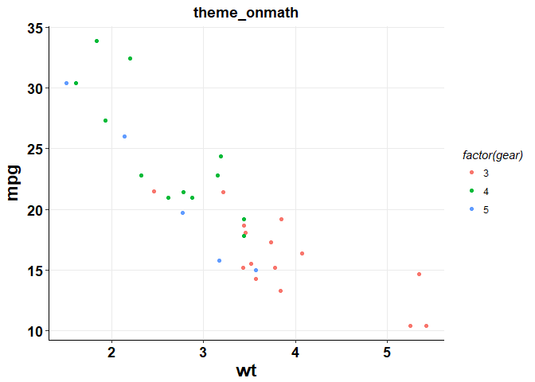
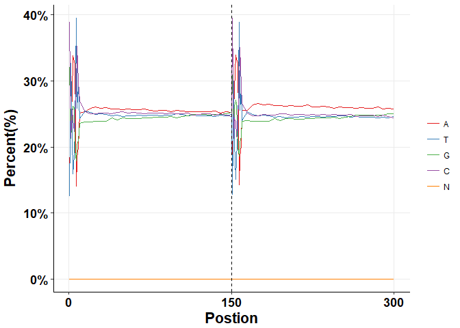
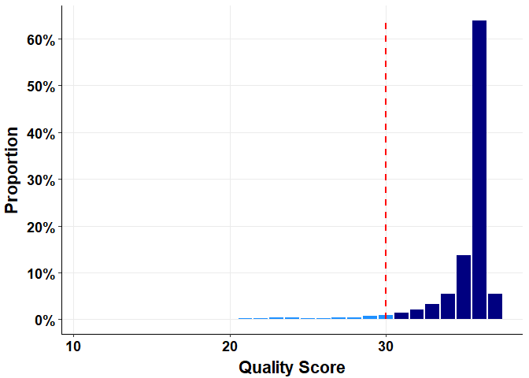

omplotr: 'ggplot2' Based RNAseq Plot Function Collection.
=========================================================

Theme
-----

`theme_onmath` is a ggplot theme used in almost all rnaseq plots.

``` r
library(omplotr)
```

    ## Loading required package: ggplot2

``` r
p <- ggplot(mtcars) + geom_point(aes(x = wt, y = mpg,colour = factor(gear)))
p + theme_onmath() + ggtitle("theme_onmath")
```



Plot
----

functions to generate plot in ngs analysis

### QC

#### Reads GC distribution

``` r
gc_line_plot(gc_test_data)
```



#### Reads Quality barplot

``` r
reads_quality_plot(rq_test_data)
```


