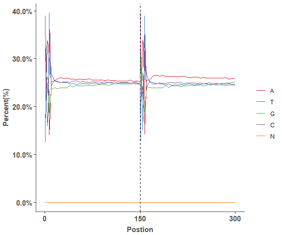
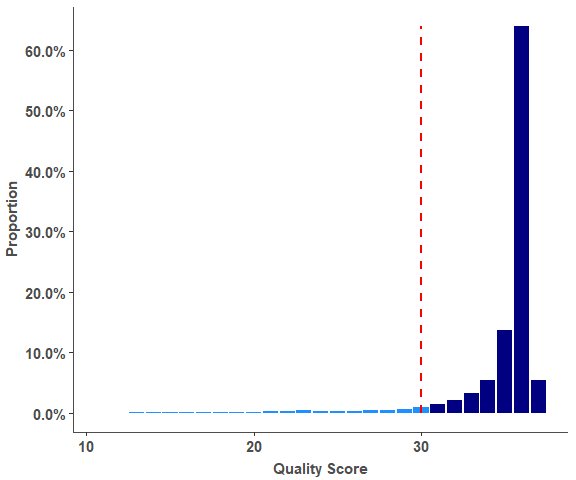
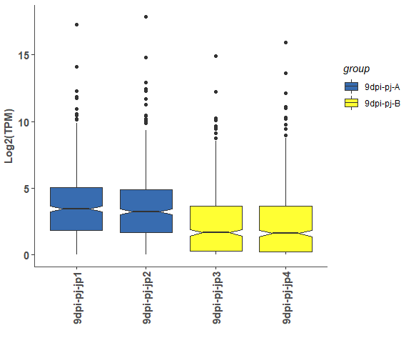
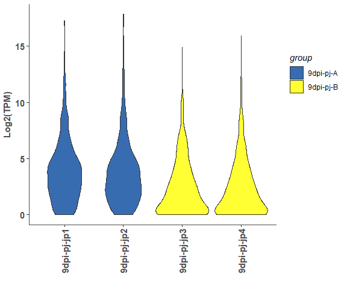
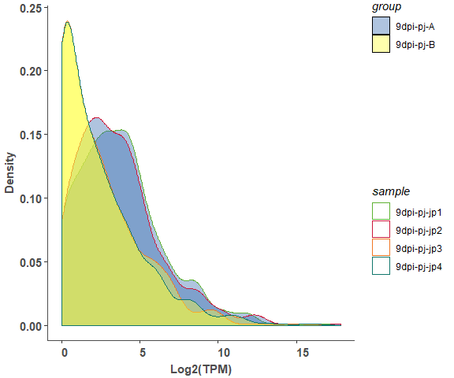
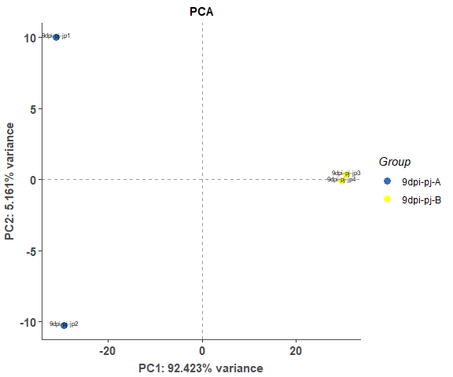
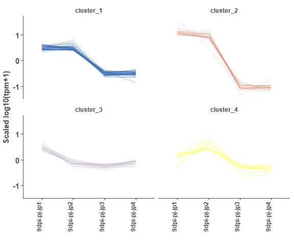

<!-- README.md is generated from README.Rmd. Please edit that file -->

omplotr: 'ggplot2' Based RNAseq Plot Function Collection
========================================================

Theme
-----

`theme_onmath` is a ggplot theme used in almost all rnaseq plots.

``` r
library(omplotr)
p <- ggplot(mtcars) + geom_point(aes(x = wt, y = mpg,colour = factor(gear)))
p + theme_onmath() + ggtitle("theme_onmath")
```


Plot
----

functions to generate plot in ngs analysis

### QC

#### Reads GC distribution

``` r
# Fastqc GC result
head(gc_test_data, 4)
#>   X.Base     sample variable     value
#> 1      1 DZ-A-LDY-1        A 0.1644290
#> 2      2 DZ-A-LDY-1        A 0.2451466
#> 3      3 DZ-A-LDY-1        A 0.2764013
#> 4      4 DZ-A-LDY-1        A 0.3381226

# lineplot of GC distribution across Fastq file
gc_line_plot(gc_test_data)
```



#### Reads Quality barplot

``` r
# Reads Quality result
# Bars of Quality <= 30 were marked with color 'dodgerblue', 
# Bars of Quality > 30 were marked with color 'navy'.
head(rq_test_data, 4)
#>   Quality Count   Proportion      color     sample
#> 1      11    57 1.016564e-06 dodgerblue YP-B-WYX-6
#> 2      12  7352 1.311189e-04 dodgerblue YP-B-WYX-6
#> 3      13 40981 7.308736e-04 dodgerblue YP-B-WYX-6
#> 4      14 57256 1.021129e-03 dodgerblue YP-B-WYX-6

# Reads Quality barplot
reads_quality_plot(rq_test_data)
```



### Quant

#### expression box, violin and density plot

``` r
# expression matrix
head(exp_test_data, 4)
#>                 9dpi-pj-jp1 9dpi-pj-jp2 9dpi-pj-jp3 9dpi-pj-jp4
#> ENSRNA049464904      64.515      48.860      34.595      25.636
#> ENSRNA049468231   17763.048   28554.280    4878.607   12802.249
#> ENSRNA049468277     544.106    1152.839     169.713     497.665
#> ENSRNA049471043    4926.117    7815.150    1198.127    4545.421

# sample information
head(test_sample_data, 4)
#>   condition      sample
#> 1 9dpi-pj-A 9dpi-pj-jp1
#> 2 9dpi-pj-A 9dpi-pj-jp2
#> 3 9dpi-pj-B 9dpi-pj-jp3
#> 4 9dpi-pj-B 9dpi-pj-jp4

# boxplot
om_boxplot(exp_test_data, test_sample_data, 'box')
```



``` r

# violin
om_boxplot(exp_test_data, test_sample_data, 'violin')
```



``` r

# density
om_boxplot(exp_test_data, test_sample_data, 'density')
```



``` r
# merged plot
om_boxplot(exp_test_data, test_sample_data, 'all')
```


#### expression PCA analysis point plot

``` r
om_pca_plot(exp_test_data, test_sample_data)
```



### expression correlation heatmap

``` r
om_correlation_plot(exp_test_data, test_sample_data)
```


#### diff expression volcano plot

``` r
# diff result
head(diff_test_data, 4)
#>                  Gene_ID X9dpi.pj.jp1 X9dpi.pj.jp2 X9dpi.pj.jp3
#> 21437       Os01g0977250        4.780        4.551        7.806
#> 33806       Os03g0738600        1.209        0.946        1.338
#> 30663       Os03g0823900        5.598        5.303        6.322
#> 32700 EPlOSAG00000051674        0.000        0.000        1.482
#>       X9dpi.pj.jp4       logFC    PValue       FDR          compare
#> 21437        6.489 -0.21257899 0.3964249 0.6631611 Case1_vs_Control
#> 33806        1.392  0.03988567 0.9082303 1.0000000 Case1_vs_Control
#> 30663        7.596  0.04831892 0.8428859 0.9858939 Case1_vs_Control
#> 32700        0.000 -2.62518576 1.0000000 1.0000000 Case1_vs_Control

# plot volcano plot for a single compare
om_volcano_plot(diff_test_data, 'Case_vs_Control')
```


``` r

# plot volcano plot for merged results
om_volcano_plot(diff_test_data, 'ALL')
```


#### expression heatmap

``` r
# plot expression heatmap
om_heatmap(exp_test_data, test_sample_data)
```


#### expression cluster line plot

``` r
# cluster result
head(cluster_test_data, 4)
#>     cluster            Gene_id    variable     value
#> 1 cluster_1 EPlOSAG00000008604 9dpi-pj-jp1 0.4935853
#> 2 cluster_1 EPlOSAG00000018483 9dpi-pj-jp1 0.5236810
#> 3 cluster_1 EPlOSAG00000027962 9dpi-pj-jp1 0.5008437
#> 4 cluster_1 EPlOSAG00000045132 9dpi-pj-jp1 0.4879498

# cluster plot
om_cluster_plot(cluster_test_data)
```



### Enrichment analysis

#### GO

``` r
# diff genes
test_diff_genes <- go_test_data_list[['test_diff_genes']]
head(test_diff_genes, 4)
#> [1] "Os01g0150000" "Os01g0172600" "Os01g0220700" "Os01g0303600"

# gene length
test_gene_len <- go_test_data_list[['test_gene_len']]
head(test_gene_len, 4)
#>        gene_id gene_len
#> 1 Os01g0290700     2289
#> 2 Os01g0249200     5219
#> 3 Os01g0152200     3747
#> 4 Os01g0295700     5836

# go annotation
test_go_anno <- go_test_data_list[['test_go_anno']]
head(test_go_anno, 4)
#>        gene_id      go_id
#> 1 Os01g0100100 GO:0005622
#> 2 Os01g0100100 GO:0006886
#> 3 Os01g0100100 GO:0017137
#> 4 Os01g0100100 GO:0005096

# run goseq and show result
goseq_output <- om_goseq(test_diff_genes, test_gene_len, test_go_anno)
head(goseq_output, 4)
#>       category over_represented_pvalue    qvalue numDEInCat numInCat
#> 571 GO:0010287             0.008881002 0.3812842          2        2
#> 848 GO:0042803             0.008933210 0.3812842          2        2
#> 76  GO:0001172             0.024128606 0.3812842          2        3
#> 123 GO:0003968             0.024128606 0.3812842          2        3
#>                                     term ontology
#> 571                        plastoglobule       CC
#> 848    protein homodimerization activity       MF
#> 76          transcription, RNA-templated       BP
#> 123 RNA-directed RNA polymerase activity       MF
#>                         DE_id
#> 571 Os01g0118000,Os01g0173000
#> 848 Os01g0235200,Os01g0251000
#> 76  Os01g0198000,Os01g0198100
#> 123 Os01g0198000,Os01g0198100

# get topgo go annotation file
gene_go_map <- system.file("extdata", "topgo_test_data.txt", package = "omplotr")

# run topGO
om_topgo(gene_go_map, test_diff_genes, goseq_output)
```


