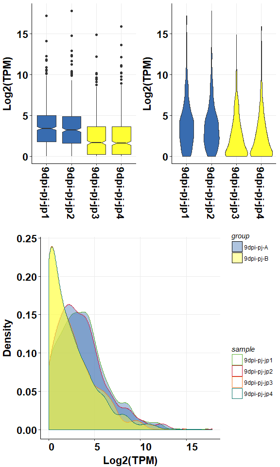

<!-- README.md is generated from README.Rmd. Please edit that file -->

omplotr: 'ggplot2' Based RNAseq Plot Function Collection
========================================================

Theme
-----

`theme_onmath` is a ggplot theme used in almost all rnaseq plots.

``` r
library(omplotr)
```

    #> Loading required package: ggplot2

``` r
p <- ggplot(mtcars) + geom_point(aes(x = wt, y = mpg,colour = factor(gear)))
p + theme_onmath() + ggtitle("theme_onmath")
```



Plot
----

functions to generate plot in ngs analysis

### QC

#### Reads GC distribution

``` r
# Fastqc GC result
head(gc_test_data, 4)
```

    #>   X.Base     sample variable     value
    #> 1      1 DZ-A-LDY-1        A 0.1644290
    #> 2      2 DZ-A-LDY-1        A 0.2451466
    #> 3      3 DZ-A-LDY-1        A 0.2764013
    #> 4      4 DZ-A-LDY-1        A 0.3381226

``` r
# lineplot of GC distribution across Fastq file
gc_line_plot(gc_test_data)
```


#### Reads Quality barplot

``` r
# Reads Quality result
# Bars of Quality <= 30 were marked with color 'dodgerblue', 
# Bars of Quality > 30 were marked with color 'navy'.
head(rq_test_data, 4)
```

    #>   Quality Count   Proportion      color     sample
    #> 1      11    57 1.016564e-06 dodgerblue YP-B-WYX-6
    #> 2      12  7352 1.311189e-04 dodgerblue YP-B-WYX-6
    #> 3      13 40981 7.308736e-04 dodgerblue YP-B-WYX-6
    #> 4      14 57256 1.021129e-03 dodgerblue YP-B-WYX-6

``` r
# Reads Quality barplot
reads_quality_plot(rq_test_data)
```


### Quant

#### expression box, violin and density plot

``` r
# expression matrix
head(exp_test_data, 4)
```

    #>                 9dpi-pj-jp1 9dpi-pj-jp2 9dpi-pj-jp3 9dpi-pj-jp4
    #> ENSRNA049464904      64.515      48.860      34.595      25.636
    #> ENSRNA049468231   17763.048   28554.280    4878.607   12802.249
    #> ENSRNA049468277     544.106    1152.839     169.713     497.665
    #> ENSRNA049471043    4926.117    7815.150    1198.127    4545.421

``` r
# sample information
head(test_sample_data, 4)
```

    #>   condition      sample
    #> 1 9dpi-pj-A 9dpi-pj-jp1
    #> 2 9dpi-pj-A 9dpi-pj-jp2
    #> 3 9dpi-pj-B 9dpi-pj-jp3
    #> 4 9dpi-pj-B 9dpi-pj-jp4

``` r
# boxplot
om_boxplot(exp_test_data, test_sample_data, 'box')
```


``` r
# violin
om_boxplot(exp_test_data, test_sample_data, 'violin')
```


``` r
# density
om_boxplot(exp_test_data, test_sample_data, 'density')
```


``` r
# merged plot
om_boxplot(exp_test_data, test_sample_data, 'all')
```


#### expression PCA analysis point plot

``` r
om_pca_plot(exp_test_data, test_sample_data)
```


### expression correlation heatmap

``` r
om_correlation_plot(exp_test_data, test_sample_data)
```


#### diff expression volcano plot

``` r
# diff result
head(diff_test_data, 4)
```

    #>                  Gene_ID X9dpi.pj.jp1 X9dpi.pj.jp2 X9dpi.pj.jp3
    #> 21437       Os01g0977250        4.780        4.551        7.806
    #> 33806       Os03g0738600        1.209        0.946        1.338
    #> 30663       Os03g0823900        5.598        5.303        6.322
    #> 32700 EPlOSAG00000051674        0.000        0.000        1.482
    #>       X9dpi.pj.jp4       logFC    PValue       FDR          compare
    #> 21437        6.489 -0.21257899 0.3964249 0.6631611 Case1_vs_Control
    #> 33806        1.392  0.03988567 0.9082303 1.0000000 Case1_vs_Control
    #> 30663        7.596  0.04831892 0.8428859 0.9858939 Case1_vs_Control
    #> 32700        0.000 -2.62518576 1.0000000 1.0000000 Case1_vs_Control

``` r
# plot volcano plot for a single compare
om_volcano_plot(diff_test_data, 'Case_vs_Control')
```


``` r
# plot volcano plot for merged results
om_volcano_plot(diff_test_data, 'ALL')
```


#### expression heatmap

``` r
# plot expression heatmap
om_heatmap(exp_test_data, test_sample_data)
```


#### expression cluster line plot

``` r
# cluster result
head(cluster_test_data, 4)
```

    #>     cluster            Gene_id    variable     value
    #> 1 cluster_1 EPlOSAG00000008604 9dpi-pj-jp1 0.4935853
    #> 2 cluster_1 EPlOSAG00000018483 9dpi-pj-jp1 0.5236810
    #> 3 cluster_1 EPlOSAG00000027962 9dpi-pj-jp1 0.5008437
    #> 4 cluster_1 EPlOSAG00000045132 9dpi-pj-jp1 0.4879498

``` r
# cluster plot
om_cluster_plot(cluster_test_data)
```


